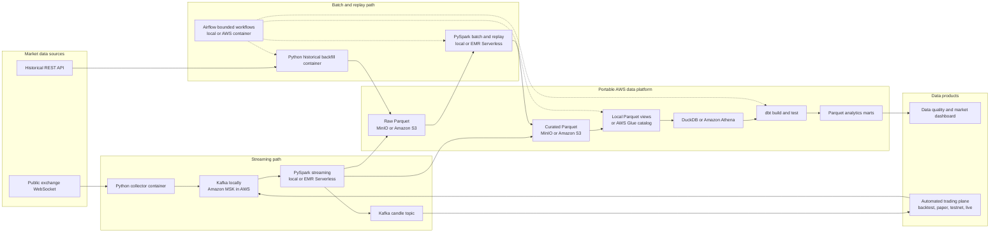
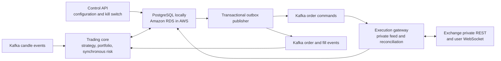
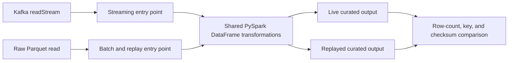
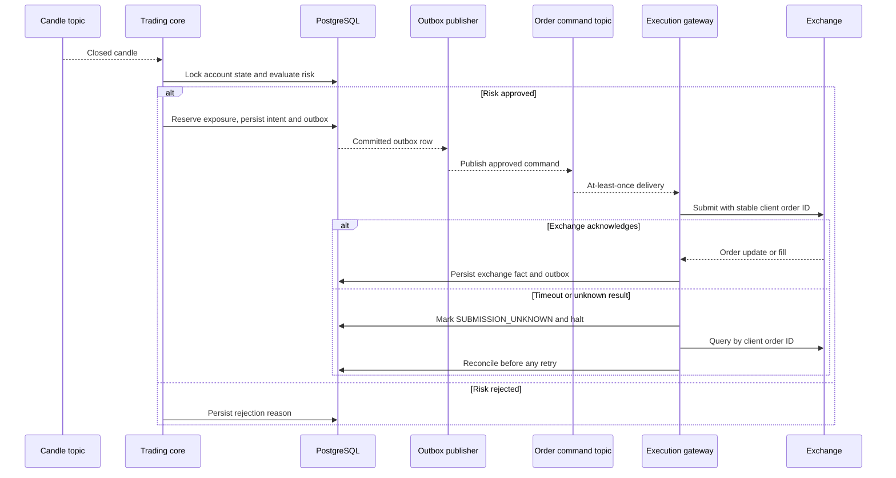

# Practical AWS-Portable Architecture for a Crypto Trading and Data Platform

> **Status:** Proposed architecture, reviewed against the July 2026 data-engineering market.
>
> **Primary objective:** Build the smallest credible system that demonstrates production-style data engineering and can progress safely into a functional automated trading system.

This project has two cooperating planes:

1. A **portable data plane** that ingests, processes, stores, tests, replays, and serves market and trading data locally or on AWS.
2. A **transactional trading plane** that runs a strategy, applies synchronous risk controls, submits orders, records fills, and reconciles local state with the exchange.

The same strategy and domain code progresses through backtest, live paper, exchange testnet, and live modes. Low-latency execution is outside scope; correctness, recoverability, and safe unattended operation are the priorities.

A strong portfolio project can improve interview credibility, but it cannot guarantee a particular salary or hiring timeline. Current US salary benchmarks show that six-figure data-engineering compensation is realistic, while location, seniority, experience, and interview performance remain decisive. See [Robert Half's 2026 Data Engineer salary benchmark](https://www.roberthalf.com/us/en/job-details/data-engineer).

Likewise, an automated system can place and manage orders without being profitable. Profitability requires separate strategy research, realistic fees and slippage, out-of-sample evaluation, forward testing, and continued monitoring.

## 1. Scope and constraints

### In scope

- Target roles: Data Engineer, Cloud Data Engineer, Data Pipeline Engineer, and Streaming Data Engineer
- One public crypto exchange integration
- One to three liquid trading pairs
- Public trade data first; order-book data only after the core pipeline is complete
- A live streaming path and a deterministic batch/replay path
- Raw immutable history, curated datasets, and analytical marts
- One simple strategy that runs unchanged in backtest, paper, testnet, and live modes
- Transactional order, fill, position, risk-limit, and reconciliation state
- Automated spot order submission through one exchange adapter
- Pre-trade risk checks, a kill switch, stale-data protection, and periodic exchange reconciliation
- Local development with Docker Compose and a low-cost, reproducible AWS deployment
- Data contracts, tests, monitoring, CI/CD, infrastructure as code, and operational documentation

### Explicit non-goals

- Ultra-low-latency execution
- Derivatives, leverage, margin, or short selling
- Multiple exchanges
- Multiple concurrent strategies
- A fleet of microservices
- Kubernetes
- Multi-cloud deployment
- Machine learning or a feature store
- Flink, ClickHouse, TimescaleDB, Iceberg, or Delta Lake
- A custom frontend

These can be useful technologies, but adding them before the core is complete would reduce the probability of shipping a polished project.

## 2. Career-oriented technology choices

Current job-posting analyses repeatedly group Python, SQL, Spark, Airflow, Kafka, dbt, cloud platforms, CI/CD, and Terraform in data-engineering roles. The current AWS Certified Data Engineer - Associate outline likewise covers ingestion, transformation, orchestration, data-store management, operations, security, governance, cost, and performance. See [2026 data-engineering job-posting analysis](https://interviewstack.io/blog/data-engineer-skills-companies-want-2026) and the [AWS Certified Data Engineer - Associate exam guide](https://docs.aws.amazon.com/aws-certification/latest/data-engineer-associate-01.html).

The project therefore uses one opinionated stack:

| Capability | Technology | What it proves |
|---|---|---|
| Collection and services | Python, `asyncio`, Pydantic | API integration, typed code, concurrency, packaging, and testing |
| Querying and modeling | Advanced SQL | Window functions, incremental logic, dimensional modeling, and performance tuning |
| Event streaming | Apache Kafka in KRaft mode | Partitions, keys, consumer groups, offsets, replay, backpressure, and delivery semantics |
| Distributed processing | PySpark and Spark Structured Streaming | DataFrames, shuffles, partitioning, event time, watermarks, checkpoints, state, and batch/stream reuse |
| Raw and curated storage | MinIO locally, Amazon S3 in AWS, and Parquet in both | S3-compatible object storage, columnar formats, partition design, retention, and replay |
| Analytical query and catalog | DuckDB locally; Amazon Athena and AWS Glue Data Catalog in AWS | Portable SQL, external-table design, partition pruning, schema management, security, and scan-cost control |
| Transactional trading state | PostgreSQL locally and Amazon RDS for PostgreSQL in live mode | ACID transactions, constraints, state machines, outbox/inbox processing, and reconciliation |
| Transformations | dbt Core with `dbt-duckdb` locally and `dbt-athena-community` in AWS | Incremental models, tests, documentation, lineage, adapter isolation, and analytics engineering |
| Orchestration | Apache Airflow | DAG design, retries, backfills, dependencies, deadline alerts, and operational recovery |
| Infrastructure | Terraform | Reproducible AWS resources, IAM, environments, budgets, and teardown |
| Delivery | Docker Compose and GitHub Actions | Local reproducibility, automated testing, validation, and deployment workflows |
| Reliability | pytest, Testcontainers, dbt tests, structured logs, and Amazon CloudWatch | Contract, integration, data-quality, replay, and operational testing |

### Why Spark before Flink

Flink is excellent for specialist streaming roles, but Spark provides a broader hiring surface across batch processing, lakehouse work, ETL, analytics, and streaming. This project will still teach event-time processing, watermarks, late data, state, and checkpoint recovery through [Spark Structured Streaming](https://spark.apache.org/docs/latest/streaming/index.html).

### Why Airflow

Airflow has broad job-market recognition and is appropriate for finite work such as backfills, data-quality checks, catalog publication, compaction, and `dbt build`. It must **not** supervise or repeatedly schedule the continuously running Kafka consumer. Airflow describes itself as a platform for developing, scheduling, and monitoring batch-oriented workflows. See the [Airflow documentation](https://airflow.apache.org/docs/apache-airflow/stable/).

### Why S3-compatible Parquet, DuckDB, and Athena

The durable system of record is partitioned Parquet behind an S3-compatible API, not a cloud-only warehouse. MinIO provides that API locally and Amazon S3 provides it in AWS. Spark receives bucket, prefix, endpoint, credentials-provider, and path-style settings through configuration, so transformations and storage layouts do not change when the endpoint changes.

DuckDB reads the local Parquet datasets directly and supports S3-compatible object stores. In AWS, Athena queries the same Parquet layout while the AWS Glue Data Catalog holds explicit table metadata. The two query engines are not treated as identical: portable dbt models use ANSI SQL, and the small number of engine-specific expressions and materializations live behind adapter-dispatched macros. See [DuckDB data sources](https://duckdb.org/docs/stable/data/data_sources), [Athena data sources](https://docs.aws.amazon.com/athena/latest/ug/work-with-data-stores.html), and [Athena with the AWS Glue Data Catalog](https://docs.aws.amazon.com/athena/latest/ug/data-sources-glue.html).

Athena is preferred over introducing Amazon Redshift in the first release because it preserves the Parquet-on-object-storage contract and keeps an idle portfolio environment inexpensive. Redshift remains a future serving option if measured concurrency or latency requirements justify a separate warehouse; it never becomes the only copy of raw or curated data.

## 3. System architecture



The live stream and historical replay converge on the same curated contract. This is the most important architectural property in the project: a fixed input dataset must produce equivalent results whether it is processed live or replayed later.

### Component responsibilities

| Component | Responsibilities |
|---|---|
| Python collector | Connect to the exchange, reconnect safely, timestamp receipt, preserve source identifiers, validate basic fields, and publish to Kafka |
| Historical backfill | Fetch bounded time ranges, respect rate limits, write manifests, and safely resume partial runs |
| Kafka / Amazon MSK | Buffer events, preserve ordering per key and partition, support multiple consumers, and retain enough history for short replays |
| Spark streaming job / EMR Serverless streaming | Archive raw records, parse and normalize events, apply event-time watermarks, deduplicate, quarantine invalid records, and build one-minute candles |
| Spark batch/replay job / EMR Serverless batch | Read immutable raw Parquet, reuse the streaming transformation module, repair a date range, and verify deterministic output |
| Trading core | Run the strategy, maintain portfolio state, apply synchronous risk checks, persist decisions, and create order intents |
| Execution gateway | Convert approved intents into exchange-specific API requests, persist exchange facts, and publish them through the outbox |
| Reconciler (gateway module) | Compare orders, fills, balances, and positions with exchange truth before startup and on a schedule |
| PostgreSQL | Store strategy configuration, risk limits, order state, fills, positions, idempotency keys, and the transactional outbox/inbox |
| MinIO / Amazon S3 | Expose the same S3 object API and store immutable raw data, curated Parquet, checkpoints, manifests, and marts independently of Kafka retention |
| DuckDB / Athena | Query the same partitioned Parquet layouts locally or in AWS without loading data into a proprietary warehouse |
| AWS Glue Data Catalog | Store cloud table, column, location, and partition metadata for Athena and EMR; schemas are declared by code rather than inferred on every run |
| dbt | Build tested facts, dimensions, and business-facing marts through a local DuckDB target or an AWS Athena target |
| Airflow | Orchestrate only bounded jobs: backfills, replay, compaction, catalog publication, dbt, and quality checks |
| Terraform | Provision S3 buckets, Glue databases and tables, Athena workgroups, IAM roles, secrets, budgets, and optional compute |
| GitHub Actions | Run code, contract, integration, dbt, and Terraform checks before changes merge |

### Automated trading plane



The trading core is deliberately one coarse-grained Python service. Strategy, portfolio accounting, risk, and the order state machine share one transactional boundary so account-level limits cannot race across independent services. The execution gateway is separate because it owns an unreliable external side effect: submitting an order to the exchange. Reconciliation is a module inside the gateway, not another deployed service and not an Airflow task.

Strategy code never calls an exchange directly. It emits a signal, the trading core evaluates current state and risk limits, and an approved order intent is committed to PostgreSQL together with an outbox record. The gateway consumes the resulting command, uses a stable client-generated order ID, and publishes exchange responses as facts. Current Coinbase and Kraken APIs both expose client order identifiers that support robust tracking and duplicate protection; the selected adapter must verify the exact semantics of its exchange. See [Coinbase Advanced Trade create order](https://docs.cdp.coinbase.com/api-reference/advanced-trade-api/rest-api/orders/create-order) and [Kraken client order identifiers](https://docs.kraken.com/api/blog/cl-ord-id/).

The exchange remains the source of truth for accepted orders, fills, balances, and positions. On every startup, after a private WebSocket reconnect, and on a fixed schedule, the reconciler must repair local projections before new orders are allowed.

### Trading modes

| Mode | Market clock | Execution adapter | Purpose |
|---|---|---|---|
| Backtest | Historical event time | Deterministic simulator | Strategy research and regression testing |
| Paper | Live event time | Local fill simulator | Unattended operation without exchange risk |
| Testnet / sandbox | Live event time | Exchange test environment | Authentication, request, reconnect, and order-lifecycle testing |
| Live | Live event time | Production exchange API | Small-capital automated spot trading after every safety gate passes |

The mode is injected through configuration; strategy and risk code are shared. Only clock, market-data source, and execution adapter change.

The exchange is selected partly on engineering and safety criteria: legal availability in the operating jurisdiction, documented spot APIs and rate limits, public and private WebSocket feeds, stable client order IDs, order/fill query endpoints, trade-only credentials, and a representative test environment when available. If no realistic sandbox exists, recorded contract tests plus paper and shadow modes replace that step; the safety gates are not relaxed.

## 4. Kafka and event-contract design

Kafka ordering exists only within a partition. Market events are keyed by:

```text
exchange:symbol
```

That keeps events for one instrument ordered while permitting parallel processing across instruments. See the [Kafka documentation](https://kafka.apache.org/documentation/).

Trading commands that affect portfolio-wide limits are keyed by `account_id` so one consumer processes an account serially. Order and fill facts carry both `account_id` and `client_order_id`.

### Initial topics

| Topic | Purpose | Retention |
|---|---|---|
| `market.trades.raw.v1` | Exchange trade messages with ingestion metadata | Short replay window |
| `market.candles.1m.v1` | Event-time one-minute candles produced by Spark | Medium replay window |
| `pipeline.dead_letter.v1` | Invalid events with error context and original payload | Long enough for investigation |
| `strategy.signals.v1` | Strategy observations and proposed actions | Medium replay window |
| `orders.commands.v1` | Approved submit, cancel, or replace commands | Until all commands are terminal and archived |
| `orders.events.v1` | Accepted, rejected, open, cancelled, and unknown order facts | Long enough for recovery and audit |
| `fills.v1` | Exchange execution facts, fees, and liquidity metadata | Long enough for recovery and audit |
| `account.reconciliation.v1` | Position, balance, and divergence findings | Long enough for investigation |

Every event envelope contains:

```text
event_id
event_type
schema_version
exchange
symbol
event_time
ingested_at
source_sequence
producer
trace_id
correlation_id
causation_id
payload
```

Use UTC timestamps and retain both `event_time` and `ingested_at`. Event time drives market calculations; ingestion time measures pipeline delay and helps diagnose late data.

Commands request an action, such as `SubmitOrder`; events state facts, such as `OrderAccepted` or `FillReceived`. Facts are never rewritten. Corrections are represented by new events and reflected in PostgreSQL and analytical projections.

The walking skeleton can use versioned JSON validated by Pydantic and a checked-in JSON Schema. After the pipeline is stable, upgrade the Kafka contracts to Avro plus Schema Registry and add backward-compatibility checks. Schema governance is the skill being demonstrated; the serialization format should not block the first end-to-end delivery.

## 5. Data lifecycle and analytical model

| Layer | Location | Contents | Rules |
|---|---|---|---|
| Raw / Bronze | MinIO or Amazon S3 Parquet | Original Kafka key, value, headers, topic, partition, offset, source time, and ingestion time | Append-only, immutable, replayable |
| Curated / Silver | MinIO or Amazon S3 Parquet | Parsed, normalized, deduplicated market, order, fill, and reconciliation facts | Versioned schema, quarantined failures, compacted files |
| Core | Partitioned Parquet exposed through DuckDB views or AWS Glue external tables | Query-ready trades, candles, orders, fills, pipeline runs, and quality results | Partitioned by event date; sorted within files by exchange and symbol |
| Marts / Gold | Parquet produced by dbt through DuckDB or Athena | Interview-ready analytical and operational models | Tested, documented, owned, and query-engine portable |

### Initial analytical models

- `fct_market_trades`
- `fct_market_candles_1m`
- `fct_orders`
- `fct_fills`
- `fct_position_snapshots`
- `fct_pipeline_runs`
- `fct_data_quality_results`
- `dim_exchange`
- `dim_instrument`
- `mart_market_daily`
- `mart_pipeline_health_hourly`
- `mart_strategy_performance_daily`
- `mart_execution_quality_daily`

Parquet datasets must be partitioned and compacted deliberately. The project should compare DuckDB query plans locally and Athena bytes scanned and query cost in AWS before and after optimization rather than merely stating that optimization exists. Athena recommends partitioning around common filters, using columnar formats such as Parquet, and avoiding excessive small files. See [Optimize data for Amazon Athena](https://docs.aws.amazon.com/athena/latest/ug/performance-tuning-data-optimization-techniques.html).

### PostgreSQL operational schema

PostgreSQL is not a tick warehouse. It stores only the small, strongly consistent state required to trade:

- `strategy_versions`
- `strategy_config`
- `risk_limits`
- `order_intents`
- `orders`
- `fills`
- `positions`
- `balances`
- `consumer_inbox`
- `event_outbox`
- `reconciliation_runs`
- `system_control`

Money and quantity values use fixed-precision decimals or exchange-native integer units, never binary floating point. Database constraints enforce unique event and client order IDs plus legal order-state transitions.

## 6. One transformation implementation for live and replay



Transformation logic belongs in pure DataFrame functions that do not know whether the caller is a streaming or batch job. Entry points handle input, checkpoints, run metadata, and output.

For a fixed raw dataset and code version:

- Primary keys must match.
- Aggregate row counts must match.
- OHLCV values must match.
- Duplicate and quarantine counts must match.
- Differences must fail the replay validation job.

## 7. Reliability and data-quality guarantees

The project uses **at-least-once delivery with idempotent processing**. It does not claim end-to-end exactly-once behavior.

### Required failure handling

- Reconnect WebSockets with bounded exponential backoff and jitter.
- Record disconnects and source sequence gaps.
- Resume Kafka consumers from committed offsets.
- Give every Spark query a durable, unique checkpoint directory.
- Deduplicate by stable `event_id` inside an event-time watermark.
- Preserve malformed records in the dead-letter topic and raw layer.
- Make catalog publication and Parquet mart writes idempotent using a manifest or deterministic run identifier.
- Make Airflow retries safe; rerunning a successful interval must not create duplicates.
- Compact small Parquet files as a scheduled bounded job.
- Keep raw data immutable so every curated dataset can be rebuilt.

### Trading correctness and safety

Kafka, PostgreSQL, and an exchange API cannot form one atomic transaction. A gateway can submit an order successfully and then crash before recording the response. The system handles this ambiguity explicitly:



An ambiguous order submission never goes to a dead-letter queue and is never retried blindly. The gateway marks it `SUBMISSION_UNKNOWN`, halts new orders for the account, and queries the exchange using the stable client order ID. If the result remains unknowable, trading stays halted for manual review.

The trading transaction locks the current account state, reserves pending exposure, writes the approved order intent, and writes its outbox command atomically. Consumers use inbox records and unique constraints to make duplicate events harmless.

Required synchronous controls:

- Global kill switch that defaults to trading disabled
- Maximum order notional
- Maximum gross and net position
- Maximum open orders and pending exposure
- Daily realized and unrealized loss limit
- Stale-market-data and stale-signal rejection
- Price-deviation and slippage bounds
- API-health and consecutive-failure circuit breakers
- Automatic halt on position, balance, or order divergence
- Manual recovery and reconciliation after a halt

Use exchange-native protective orders when the selected venue supports them; a local process cannot protect a position while it is offline. Live mode starts with spot trading, one symbol, no leverage, the exchange's minimum practical notional, and a separately funded account or portfolio.

### Required data tests

- `event_id` is unique and non-null in core facts.
- Exchange, symbol, event time, price, and quantity are present.
- Price and quantity are positive.
- Candle high is at least open, close, and low.
- Candle low is at most open, close, and high.
- Candle volume is non-negative.
- Event timestamps are within an explicitly allowed range.
- Source-to-raw and raw-to-curated counts reconcile after accounting for duplicates and quarantined events.
- Every expected hourly partition arrives within the freshness objective.
- A live-versus-replay fixture produces identical aggregates.
- Every order command has one stable client order ID.
- Every order transition is legal and terminal orders never reopen.
- Fills cannot exceed order quantity.
- Position changes reconcile to fills and fees.
- Pending exposure is included in every pre-trade limit check.
- The strategy cannot submit an order while data is stale, reconciliation is incomplete, or the kill switch is active.

### Metrics worth showing in interviews

- Events received and processed per second
- Kafka consumer lag
- Event-time and ingestion-time lag
- Spark micro-batch duration and input rows
- Duplicate, late, invalid, and quarantined event counts
- Raw-to-curated reconciliation difference
- Last successful Airflow interval
- DuckDB query plan locally and Athena bytes scanned and estimated cost in AWS
- Recovery time after a forced collector or Spark restart
- Signal-to-order and order-acknowledgement latency
- Order rejection, cancellation, partial-fill, fee, and slippage metrics
- Local-versus-exchange position and balance divergence
- Kill-switch, circuit-breaker, and reconciliation status

Define measurable targets only after establishing a baseline. Publish the test conditions with every throughput or latency number.

## 8. Local development and AWS deployment

The complete pipeline and trading plane must be demonstrable locally before any cloud deployment.

| Concern | Local development | Portfolio and live cloud deployment |
|---|---|---|
| Application runtime | Docker Compose using versioned OCI images | The same images on one cost-capped Amazon EC2 instance first; Amazon ECS services when independent scaling or managed scheduling is justified |
| Kafka | Single Apache Kafka broker in KRaft mode | Amazon MSK for a managed deployment; a single EC2 broker is allowed only for a disposable portfolio environment |
| Spark streaming | Local Spark container with a durable MinIO checkpoint prefix | The same container on EC2 initially, or EMR Serverless streaming when managed restart and scaling justify the cost |
| Spark batch/replay | Local Spark container | Amazon EMR Serverless using the same PySpark entry point and environment-neutral job arguments |
| Object storage | MinIO with versioned `raw/`, `curated/`, `checkpoints/`, and `marts/` prefixes | Amazon S3 with the same bucket-prefix contract and lifecycle policies |
| Catalog | Checked-in schemas and deterministic DuckDB views over Parquet | Terraform-managed AWS Glue databases, tables, and partition projection or explicit partition publication |
| Query and dbt | DuckDB with `dbt-duckdb` | Amazon Athena with `dbt-athena-community`; AWS-specific SQL is isolated behind dispatched macros |
| Orchestration | Airflow in Docker Compose | The same Airflow image on EC2 or ECS; Amazon MWAA is optional and deferred until its managed value justifies its baseline cost |
| Transactional state | PostgreSQL in Docker Compose | Amazon RDS for PostgreSQL with automated backups |
| Secrets | Ignored local environment file populated from a password manager | AWS Secrets Manager retrieved through a workload IAM role |
| Monitoring | Structured logs, health endpoints, and pipeline-health tables | Amazon CloudWatch Logs, metrics, alarms, and optional ECS Container Insights |
| Infrastructure | Compose validation and Terraform tests | Terraform-managed S3, Glue, Athena, IAM, networking, compute, RDS, secrets, and budgets |

EMR Serverless runs PySpark entry points and can access S3 and the Glue Data Catalog through a job runtime role. Bounded backfills and replays are the first managed use case. EMR Serverless streaming is supported for Structured Streaming jobs on EMR releases 7.1.0 and later, but it is an operational option rather than a code fork. See [EMR Serverless Spark jobs](https://docs.aws.amazon.com/emr/latest/EMR-Serverless-UserGuide/jobs-spark.html) and [EMR Serverless streaming jobs](https://docs.aws.amazon.com/emr/latest/EMR-Serverless-UserGuide/jobs-streaming.html).

The one-EC2 runtime is an intentional single-developer compromise, not a highly available trading platform. Every container has a restart policy and health check, but any unhealthy dependency causes the trading core to stop creating orders. After a restart, the gateway reconciles open orders, fills, balances, and positions before trading is re-enabled. A live deployment that requires broker availability moves Kafka to a multi-AZ Amazon MSK cluster rather than treating a single broker as durable infrastructure.

### Portability contract

- Build each Python service and Spark job once as a versioned OCI image; Compose and ECS supply environment-specific configuration to the same image.
- Keep Kafka topic names, keys, contracts, and consumer-group behavior identical. Moving to MSK changes bootstrap brokers, authentication, TLS, and networking—not producer or consumer semantics.
- Address object data through an `s3a://bucket/prefix` configuration. Local mode supplies the MinIO endpoint and path-style access; AWS mode uses S3 endpoints and workload IAM credentials.
- Keep paths relative to named prefixes such as `raw`, `curated`, `checkpoints`, and `marts`; application code never embeds a local filesystem path or AWS account identifier.
- Keep schemas in source control. Local DuckDB views and Terraform-managed Glue tables are generated from the same schema definitions; production does not rely on a crawler silently inferring contracts.
- Keep dbt models in portable SQL where practical. Adapter-specific functions, external locations, and materializations live in dispatched macros, and CI compiles both the DuckDB and Athena targets.
- Keep AWS SDK calls in infrastructure and environment adapters. Domain logic, event contracts, PySpark transformations, risk controls, and replay validation do not import cloud-specific clients.
- Use PostgreSQL in both environments so transactional semantics, migrations, constraints, inbox/outbox processing, and reconciliation do not change during deployment.

### Cost controls

- Terraform must create AWS Budgets alerts and make teardown straightforward.
- S3 lifecycle rules expire disposable demo data and incomplete multipart uploads.
- Athena workgroups enforce query-result locations and per-query scan limits; analytical queries filter partition columns.
- Scheduled queries and Airflow DAGs have explicit date bounds.
- Continuous cloud compute is optional through the hiring-ready release and required only when live paper, testnet, or live trading is enabled.
- Exchange and AWS credentials never enter Git, images, logs, or sample data.
- Production exchange credentials are trade-only, have withdrawals disabled, use IP restrictions when supported, and are isolated from test credentials.
- The application reads secrets through AWS Secrets Manager with least-privilege workload IAM rather than baking credentials into images or task definitions. See [AWS Secrets Manager best practices](https://docs.aws.amazon.com/secretsmanager/latest/userguide/best-practices.html).

## 9. Proposed repository structure

```text
apps/
  collector/
  historical_backfill/
  trading_core/
  execution_gateway/
  control_api/
jobs/
  spark/
    entrypoints/
    transforms/
    schemas/
packages/
  domain/
  exchange_adapters/
  observability/
analytics/
  dbt/
orchestration/
  airflow/
    dags/
schemas/
infra/
  compose/
  terraform/
tests/
  unit/
  contract/
  integration/
  replay/
docs/
  architecture/
  adr/
  runbooks/
  postmortems/
```

Use one repository and shared packages. Separate deployment units are justified only by runtime behavior: the collector is always on, Spark processes streams, the trading core owns decisions and risk, the execution gateway owns private exchange I/O, and Airflow runs bounded workflows. They do not need separate repositories or independent platform teams.

## 10. Implementation phases

Each phase ends with a working, demonstrable system. Do not begin the next phase until its acceptance criteria pass.

### Phase 1: Walking skeleton

Build:

- Exchange WebSocket collector
- Kafka topic and partitioning
- MinIO-backed raw Parquet sink using the same S3 key contract as AWS
- Docker Compose services for Kafka, MinIO, Spark, and the collector
- Unit and integration tests

Acceptance criteria:

- One command starts the local stack.
- A reconnect does not crash the collector permanently.
- Kafka offsets and MinIO raw records can be inspected.
- A forced consumer restart resumes without silently losing acknowledged data.
- A short recorded dataset can be replayed in CI.

### Phase 2: Distributed processing

Build:

- PySpark Structured Streaming pipeline
- Shared batch/stream transformations
- Event-time watermarks and deduplication
- One-minute candle aggregation
- Dead-letter handling
- Deterministic replay test

Acceptance criteria:

- Duplicate and out-of-order test events produce the expected result.
- Restarting Spark from its checkpoint does not corrupt output.
- Live and replayed candles match for the recorded fixture.
- Throughput, freshness, and error metrics are captured.

### Phase 3: Cloud analytics platform

Build:

- Terraform-managed S3, AWS Glue Data Catalog, Athena workgroups, IAM, and secrets
- Partitioned and compacted Parquet core datasets with explicit Glue schemas
- dbt facts, dimensions, marts, tests, and generated documentation for DuckDB and Athena targets
- Airflow DAGs for bounded backfill, catalog publication, dbt, and quality work

Acceptance criteria:

- `terraform apply` creates the environment and `terraform destroy` removes disposable resources.
- Re-running a backfill interval is idempotent.
- dbt tests detect a deliberately introduced data defect.
- DuckDB plans and Athena scan-cost comparisons demonstrate partition pruning.
- The dashboard exposes freshness, quality, and market metrics.

### Phase 4: Hiring-ready production evidence

Build:

- GitHub Actions checks for Python, Spark, contracts, dbt, and Terraform
- Avro and Schema Registry compatibility checks
- Operational runbook and one simulated-incident postmortem
- Architecture decisions explaining Kafka/MSK, Spark/EMR Serverless, MinIO/S3, DuckDB/Athena, and delivery semantics
- A concise README and three-to-five-minute demonstration

Acceptance criteria:

- A new developer can run the recorded-data demo from the README.
- CI proves that duplicate, late, invalid, and replayed data are handled correctly.
- The repository contains measured results rather than unverified scale claims.
- No cloud secret or private exchange credential is present.

This is the **hiring-ready stop line**. Publish the project and use it in applications, then continue to Phase 5 without making automated trading a prerequisite for the job search.

### Phase 5: Functional automated trading

Phase 5 is required for the finished product but does not block publishing the hiring-ready data platform.

#### Phase 5A: Deterministic backtest

Build:

- Shared strategy, clock, portfolio, risk, and broker interfaces
- Historical event-time runner
- Fee, spread, slippage, latency, rejection, and partial-fill simulation
- Time-separated train, validation, and out-of-sample evaluation

Gate:

- No look-ahead data is available to the strategy.
- Results are deterministic for a fixed code, configuration, and dataset version.
- Strategy results survive realistic costs and an out-of-sample period.
- Losing scenarios and drawdowns are documented rather than hidden.

#### Phase 5B: Live paper trading

Build:

- PostgreSQL ledger, inbox/outbox, and order state machine
- Live strategy and synchronous risk engine
- Paper execution adapter
- Kill switch, circuit breakers, and restart recovery

Gate:

- The service runs unattended through disconnects and restarts.
- Duplicate events and commands do not create duplicate orders or fills.
- Partial fills, rejections, stale data, and risk-limit breaches are tested.
- A halt always prevents new order creation until manual recovery.

#### Phase 5C: Exchange testnet or sandbox

Build:

- Authenticated private REST and user WebSocket adapter
- Stable client order IDs
- Submit, cancel, and order/fill lifecycle handling
- Startup, reconnect, and scheduled reconciliation
- Ambiguous-submission recovery

Gate:

- Every local order, fill, balance, and position reconciles with the exchange.
- A simulated timeout after submission does not create a duplicate order.
- Rate limits and API failures trigger bounded retries or a trading halt.
- Test credentials are isolated and never logged.

#### Phase 5D: Shadow and restricted live canary

Run live market data and real decisions with submission disabled first. Promotion to a live canary requires explicit manual approval and uses:

- Spot only
- One symbol
- The exchange's minimum practical notional
- A separately funded account or portfolio
- Trade-only credentials with withdrawals disabled
- Strict position, order, loss, and slippage limits

Gate:

- Shadow decisions match the expected paper behavior.
- No unresolved reconciliation divergence exists.
- Alerts and the kill switch have been exercised successfully.
- The rollback procedure has been rehearsed.

#### Phase 5E: Limited live trading

Increase limits only after a documented observation period with no unresolved order, position, balance, or safety-control failures. Promotion between trading modes is always manual; the system never promotes itself.

### Phase 6: Optional depth

After both the hiring-ready and functional trading goals are complete, choose at most one:

- Order-book reconstruction
- Iceberg or Delta Lake
- Flink implementation of one streaming transformation
- Debezium CDC from the PostgreSQL ledger

Optional work must not delay publishing the completed core or operating the existing system safely.

## 11. Portfolio deliverables

A recruiter sees technology names; an interviewer needs evidence that the system works. The finished repository should include:

- A one-command recorded-data demo
- This architecture and short architecture decision records
- dbt-generated data documentation and lineage
- A benchmark report with dataset size, machine size, throughput, p95 freshness, and cost
- A forced-restart and deterministic-replay demonstration
- A paper/testnet order-lifecycle demonstration including an ambiguous submission and reconciliation
- A data-quality dashboard
- A trading-safety dashboard showing limits, stale-data status, divergence, and kill-switch state
- Terraform apply/destroy instructions
- Data-pipeline and trading-operations runbooks
- One short postmortem describing a simulated failure, evidence, root cause, and prevention
- A concise video or animated terminal recording

Use measured values to complete a résumé bullet such as:

> Built a replayable crypto market-data platform using Python, Kafka, PySpark, MinIO/S3, DuckDB/Athena, Airflow, dbt, and Terraform; processed **[measured rate]**, maintained **[measured freshness]**, recovered from forced failures in **[measured time]**, and verified deterministic batch/stream results with automated quality checks.

After Phase 5, a second bullet may describe the PostgreSQL-backed trading engine, synchronous risk controls, idempotent execution, and measured reconciliation behavior.

Never invent the bracketed measurements.

## 12. Deferred technology decisions

| Technology | Decision |
|---|---|
| Flink | Defer until targeting specialist streaming roles |
| Kubernetes | Defer; existing Docker and Terraform evidence is sufficient for this project's goal |
| ClickHouse or TimescaleDB | Defer; Parquet on MinIO/S3 plus DuckDB/Athena covers the analytical workloads |
| Iceberg or Delta Lake | Defer until plain Parquet limitations can be demonstrated |
| Amazon Redshift | Defer until measured concurrency or latency requires a separate serving warehouse; S3 remains the durable analytical source of truth |
| Amazon MWAA | Defer; run the same Airflow image locally and on EC2 or ECS until managed orchestration justifies its baseline cost |
| Dagster | Defer; use Airflow for broader hiring recognition |
| Prometheus and Grafana | Defer unless CloudWatch cannot present the required metrics |
| Derivatives, leverage, and margin | Exclude until limited spot trading is operational and independently justified |
| Additional strategies | Defer until one strategy works consistently across backtest, paper, testnet, and live modes |
| Multiple exchanges | Defer until one adapter, schema, and recovery path are complete |
| Machine learning | Exclude; it would dilute the core data-engineering story |
| Multi-cloud | Exclude; the design is portable between local infrastructure and AWS, not a promise to operate several cloud providers |

The architecture succeeds when it tells two connected, defensible stories: **a single developer built, tested, deployed, observed, failed, recovered, replayed, and cost-optimized a real streaming and batch data pipeline—and then used that trusted data to operate a controlled automated trading system.**
